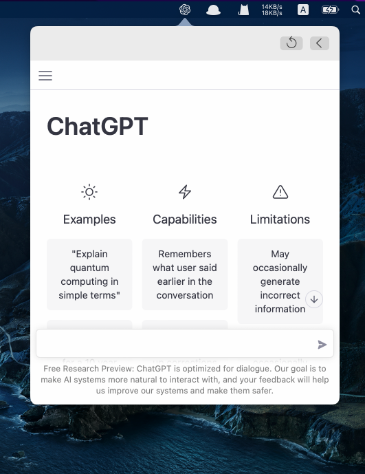

# ChatGPT-Mac-MenuBar
Chat with OpenAI's ChatGPT in mac menu bar like a pro.

✅ Lightweight. Only 650KB.

✅ `shift+cmd+C` to trigger popover globally

✅ **Right click** on the menu bar icon to **Clean Cookies** for login another OpenAI's account

✅ Handle keyboard shortcuts `cmd+c/v/x/z/a` with webview

# Credit
[OpenAI](https://openai.com/)

# Download
Instead of building the source code, you can use the archived .dmg file right away!

[ChatGPT.dmg](https://github.com/KittenYang/ChatGPT-Mac-MenuBar/raw/main/ChatGPT.dmg)

# Note
It is a very basic app to bridge a webview to the status bar. So it must have inevitable limits. Feel free to make pull requests or reach me on [@KittenYang](https://twitter.com/KittenYang)
